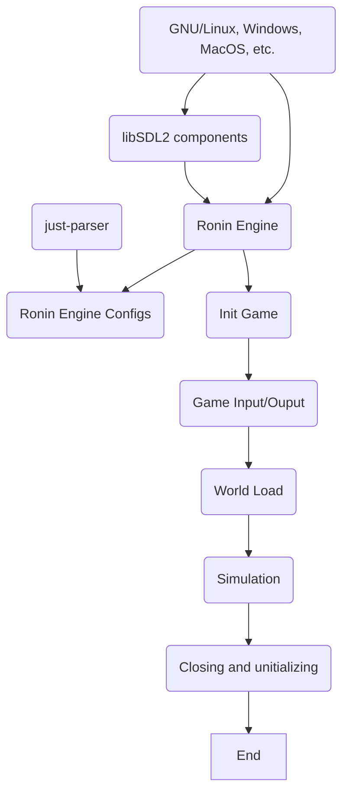

# ronin-engine framework



## [Ru]ssian Language
> Цель проекта: Обеспечение минимальной потребности для рендеринга объектов на большинства платформах (GNU/Linux, Windows, MacOS).
------------
## Зависимости
- **SDL2** - соопровождение движка визуализациями, так-же обеспечением движка ресурсами.
- **just-parser** - библиотека по управлению конфигурациями ([just-parser](https://github.com/badcast/just-parser "just-parser"))

------------
#### Как собрать движок?
```bash
#cloning sources
git clone "https://github.com/badcast/ronin-engine.git"
#into directory
cd ronin-engine
#make build directory
mkdir build
#into directory
cd build
#Building from type Release (see Debug, MinSizeRel, Release, RelWithDebInfo) from up directory (..)
cmake -DCMAKE_BUILD_TYPE=Release ..
```

