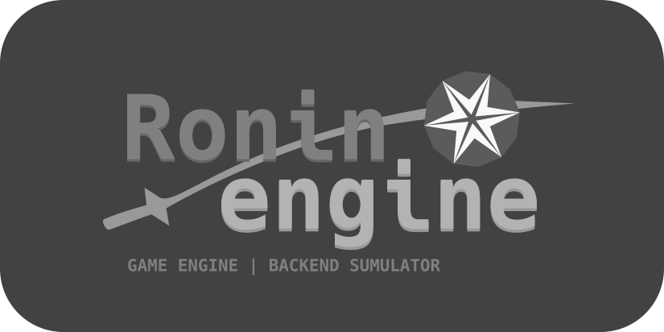

# ronin-engine

<h1 align="center">
	
</h1>

RoninEngine is a powerful game engine for developing games and user interfaces in the C++ programming language. It provides a wide range of features to create high-quality applications with ease and performance in mind.

## Key Features

- **Convenient resource and settings initialization**: RoninEngine offers intuitive tools to kickstart development without unnecessary complications.

- **CamelCase for readability**: The code in RoninEngine follows the CamelCase style, making it understandable and easily readable for developers.

- **Support for C++17 and higher**: We use modern C++ language features, starting with C++17, to make working with the engine a breeze.

- **Static and dynamic compilation**: Choose the compilation approach that suits your project - static or dynamic.

- **Effortless resource and memory management**: RoninEngine helps you avoid memory leaks and ensures efficient resource management.

- **Dynamic loading and unloading of worlds**: Create complex games with multiple scenes and levels by loading and unloading them dynamically.

- **Create your own games and GUI**: RoninEngine provides the capability to create not just games but also custom user interfaces (GUI).

## Getting Started

1. **Install Dependencies**: Before using RoninEngine, ensure you have all the necessary dependencies installed.

2. **Initialize Your Project**: Create a new project and initialize RoninEngine following the documentation.

3. **Development**: Start developing your game or application using RoninEngine's powerful capabilities.

## Documentation

Detailed information on using RoninEngine can be found in the [documentation](.).

## Examples

Code examples and projects created using RoninEngine are available in the [examples folder](.).

## Contributions and Community

If you have questions, suggestions, or just want to contribute to the development of RoninEngine, please visit our [forum](.) and [GitHub repository](https://github.com/badcast/ronin-engine).

## License

RoninEngine is distributed under the [LICENSE](LICENSE).

## Build
```bash
#cloning sources
git clone "https://github.com/badcast/ronin-engine.git"
#into directory
cd ronin-engine
#make build directory
mkdir build
#into directory
cd build
#set build type to Release (see Debug, MinSizeRel, Release, RelWithDebInfo) from up directory (..)
cmake -DCMAKE_BUILD_TYPE=Release ..
#building, optionally multithread for all threads (-j $(nproc))
cmake --build . -j $(nproc)
```

---

© [2023] RoninEngine. All rights reserved.
